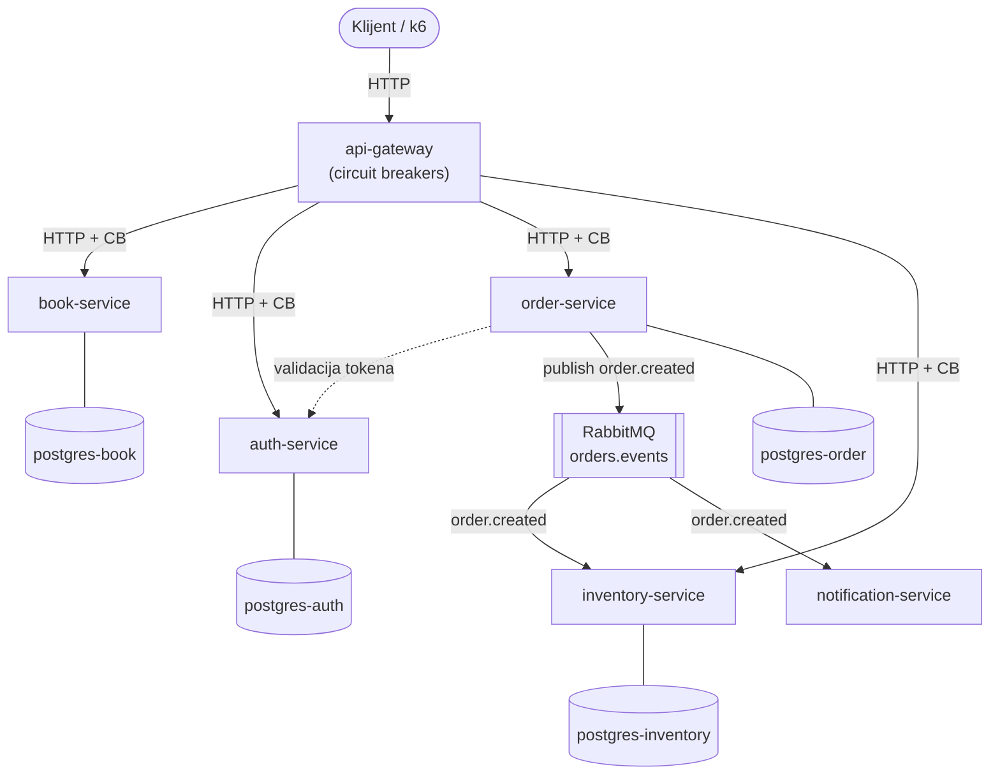

🇷🇸 Srpski | [🇬🇧 English](README.en.md)

# chaos-engineering-sandbox

Aplikacija knjižare zasnovana na mikroservisima, napravljena kao platforma za chaos engineering eksperimente. Demonstrira production-grade DevOps setup koji uključuje GitOps, full-stack observability, load testing i kontrolisano ubacivanje kvarova putem Chaos Mesh-a.


---

## Arhitektura

6 FastAPI mikroservisa koji komuniciraju putem REST-a i RabbitMQ event-a, deployovani na Kubernetes-u sa punim observability i chaos engineering stack-om.



---

## Stack

| Sloj | Alati |
|-------|-------|
| Aplikacija | FastAPI, React |
| Kontejneri | Docker, Docker Compose |
| Orkestracija | Kubernetes (kind), Helm, Kustomize |
| GitOps | ArgoCD (automatska sinhronizacija + self-heal) |
| Observability | Prometheus, Grafana, Loki, Tempo, OpenTelemetry |
| Chaos Engineering | Chaos Mesh |
| Load Testing | k6 |
| CI/CD | GitHub Actions |
| Bezbednost | Sealed Secrets, Network Policies |

---

## Brzi početak

### Preduslovi

- Docker 24+, kubectl, kind, Helm, k6
- Uputstvo za instalaciju: [docs/local-setup.md](docs/local-setup.md)

### Linux — podešavanje inotify limita (jednom, za Promtail)

```bash
sudo sysctl fs.inotify.max_user_instances=512
sudo sysctl fs.inotify.max_user_watches=524288
```

### Pokretanje celog stack-a

```bash
make cluster-up   # ~10-15 min — kreira kind klaster, instalira sve
```

Dodati u `/etc/hosts`:
```
127.0.0.1  bookstore.local api.bookstore.local grafana.monitoring.local
```

| Dashboard | URL | Kredencijali |
|-----------|-----|-------------|
| Grafana | http://grafana.monitoring.local | admin / admin |
| ArgoCD | `make argocd-ui` → localhost:8080 | admin / (videti ispod) |

```bash
# ArgoCD lozinka
kubectl -n argocd get secret argocd-initial-admin-secret \
  -o jsonpath='{.data.password}' | base64 -d
```

### Gašenje

```bash
make cluster-down
```

---

## Pokretanje na sopstvenoj mašini

**Clone i pokreni** — radi odmah, bez podešavanja. Sve slike su javne na Docker Hub-u, ArgoCD se sinhronizuje iz ovog javnog repo-a.

**Fork i preuzmi pipeline** — ažurirati `repoURL` u `deploy/argocd/bookstore-app.yaml`, nazive slika u `cd.yml` i `kustomization.yaml`, i dodati `DOCKER_USERNAME` / `DOCKER_PASSWORD` kao GitHub Actions secrets.

Detaljna uputstva: [docs/local-setup.md](docs/local-setup.md#pokretanje-na-sopstvenoj-masini-dva-scenarija).

---

## Chaos eksperimenti

Svaki eksperiment prati metodologiju vođenu hipotezom: definiši steady state → postavi hipotezu → injektuj kvar → posmatraj → zaključi.

### API Gateway Fine Tuning (4 iteracije)

| Iteracija | Promena | Rezultat |
|---|---|---|
| Pre circuit breaker-a | — | 6 restarti @ 50 VUs, kaskadni kvar |
| Posle circuit breaker-a | pybreaker + 5s timeout | 0 restarti, ali skrivena greška u kodu |
| Otkrivena event loop blokada | sinhroni httpx u async funkcijama | 9 restarti @ 15 VUs (SIGTERM) |
| asyncio.to_thread + resource fix | thread pool + CPU 500m + probe 5s | 0 restarti, 0 neuspešnih zahteva |

### Chaos eksperimenti

| Eksperiment | Target | Pre | Posle (CB + async) |
|---|---|---|---|
| Network latency (300ms DB) | book-service | Pool 75%, degradiran | Stabilan, 0 grešaka, latency propagira |
| Pod failure | order-service | 3 restarti, ~14 failed req/s | 3 restarti, **~2 failed req/s**, CB apsorbuje |
| HTTP 500 (path: *) | order-service | 6 GW restarti, 8 OS restarti | 0 GW restarti, 9 OS restarti* |
| HTTP 500 (path: /orders*) | order-service | — | **0 restarti**, sistem stabilan |
| CPU stress 80% | inventory-service | — | Latency propagira, 0 grešaka, CB ne okida |

*path: `*` pogađao `/health` endpoint — popravljeno u trećoj iteraciji

Detalji eksperimenata sa snimcima ekrana: [docs/experiments/](docs/experiments/)  
Arhitekturalne odluke: [docs/adr/](docs/adr/)  
Operativni runbooks: [docs/runbooks/](docs/runbooks/)

---

## Makefile pregled

```bash
make cluster-up       # kreira kind klaster + ceo stack
make cluster-down     # briše klaster
make cluster-status   # prikazuje čvorove i ArgoCD aplikacije

make stress           # stress test (50 VUs, traži tačku loma)
make load             # load test  (10 VUs, trajno opterećenje)
make smoke            # smoke test (brza provera ispravnosti)

make chaos-run EXPERIMENT=pod-failure-order   # pokretanje chaos eksperimenta

make grafana-ui       # port-forward Grafana na localhost:3001
make argocd-ui        # port-forward ArgoCD na localhost:8080
```

---

## Dokumentacija

- [Lokalni setup i onboarding](docs/local-setup.md)
- [ADR — Arhitekturalne odluke](docs/adr/)
- [Runbooks](docs/runbooks/)
- [Chaos eksperimenti](docs/experiments/)
